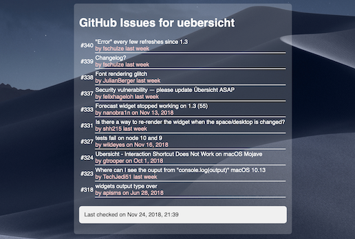

# Übersicht GitIssues Widget

This widget provides you with the ten most recently updated issues on a given GitHub repository.



## How to install

Download either the `ZIP`-file from the repository, or only the `gitissues.jsx` file, and put it into your `widgets` folder (find it by choosing `Open Widgets Folder` from the Übersicht menu). It should automatically load.

## Configuration

You have a few options to configure the GitIssues widget:

```javascript
const info = {
  // repo contains your repository name in the format <owner>/<repository>
  'repo': 'felixhageloh/uebersicht',
  // Distance of the widget to the top edge of the screen in pixels
  'top': 240,
  // Distance of the widget to the left edge of the screen in pixels
  'left': 45
}
```

The widget will update itself every ten minutes. Make sure there is an internet connection for it to retrieve data from the GitHub v3 API.

## License

This plugin's code is distributed under the GNU GPL v3 license. Please find the license text in the `LICENSE`-file.
